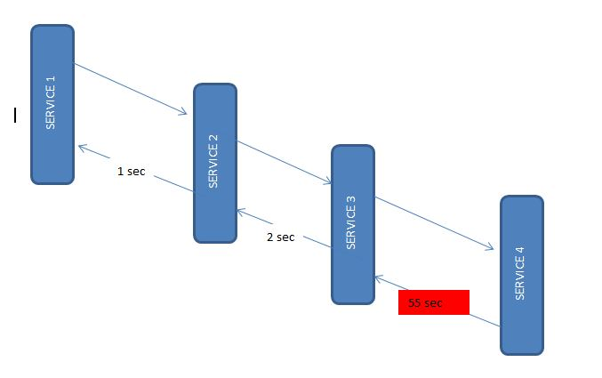

## Spring Cloud Zipkin And Sleuth Using Spring Boot

# use case:
    Let’s consider one scenario, you are working on multiple microservices and you want to trace those service logs 
    and performance. Now it becomes very hard to look for those services and find the exact log or issue.

    Here we can use Zipkin to overcome these kinds of issues.

    # Zipkin is a distributed tracing system. It helps gather timing data needed to troubleshoot latency problems in 
    service architectures. Features include both the collection and lookup of this data. 

    This is very useful during debugging when lots of microservices are implemented and the application becomes slow 
    in any particular situation. In such a case, we first need to identify to see which underlying service is actually 
    slow. Once the slow service is identified, we can work to fix that issue. Distributed tracing helps in identifying
    that slow component among in the ecosystem.

    # Sleuth is the tool provided by Spring Cloud. It is used to generate trace id, span id, and this information to 
    service calls in the headers and Mapping Diagnostic Context. So that it can be used by tools like Zipkin, ELK, etc 
    to store indexes and process logs file.

1. Zipkin
   Zipkin was originally developed at Twitter, based on a concept of a Google paper that described Google’s 
   internally-built distributed app debugger – dapper. It manages both the collection and lookup of this data. 
   To use Zipkin, applications are instrumented to report timing data to it.

    If you are troubleshooting latency problems or errors in an ecosystem, you can filter or sort all traces based on 
    the application, length of trace, annotation, or timestamp. By analyzing these traces, you can decide which 
    components are not performing as per expectations, and you can fix them.

    Internally it has 4 modules –
    
    Collector – Once any component sends the trace data, it arrives to Zipkin collector daemon. Here the trace data 
        is validated, stored, and indexed for lookups by the Zipkin collector.
    Storage – This module store and index the lookup data in backend. Cassandra, ElasticSearch and MySQL are supported.
    Search – This module provides a simple JSON API for finding and retrieving traces stored in backend. The primary 
        consumer of this API is the Web UI.
    Web UI – A very nice UI interface for viewing traces.

        1.1. Installing Zipkin
        Detailed installation steps can be found for different operating systems including the Docker image on 
        the quickstart page. For windows installation, just download the latest Zipkin server from the maven repository 
        and run the executable jar file using the below command.
        
        Start Zipkin on Windows
        java -jar zipkin-server-1.30.3-exec.jar
        
        Once Zipkin is started, we can see the Web UI at http://localhost:9411/zipkin/.
        
        The above command will start the Zipkin server with the default configuration. For advanced configuration, 
        we can configure many other things like storage, collector listeners etc.
        
        To install Zipkin in the spring boot application, we need to add Zipkin starter dependency.
        
        pom.xml
        <dependency>
            <groupId>org.springframework.cloud</groupId>
            <artifactId>spring-cloud-starter-zipkin</artifactId>
        </dependency>

2. Sleuth
   Sleuth is another tool from the Spring cloud family. It is used to generate the trace id, span id and add this 
    information to the service calls in the headers and MDC, so that It can be used by tools like Zipkin and ELK etc. 
    to store, index and process log files.

    As it is from the spring cloud family, once added to the CLASSPATH, it automatically integrated to the common 
    communication channels like –
    
    requests made with the RestTemplate etc.
    requests that pass through a Netflix Zuul microproxy
    HTTP headers received at Spring MVC controllers
    requests over messaging technologies like Apache Kafka or RabbitMQ etc.
    Using Sleuth is very easy. We just need to add it’s started pom in the spring boot project. It will add the Sleuth 
        to the project and so in its runtime.

        pom.xml
        <dependency>
            <groupId>org.springframework.cloud</groupId>
            <artifactId>spring-cloud-starter-sleuth</artifactId>
        </dependency>

So far we have integrated Zipkin and Sleuth to microservices and ran the Zipkin server. Let’s see how to utilize this setup.

3. Zipkin and Sleuth Integration
   For this demo, let us create 4 spring boot based microservices. They all will have both Zipkin and Sleuth starter 
    dependencies.

In each microservice, we will expose one endpoint and from the first service we will call the second service, and from 
the second service, we will invoke the third and so on using the RestTemplate.
    